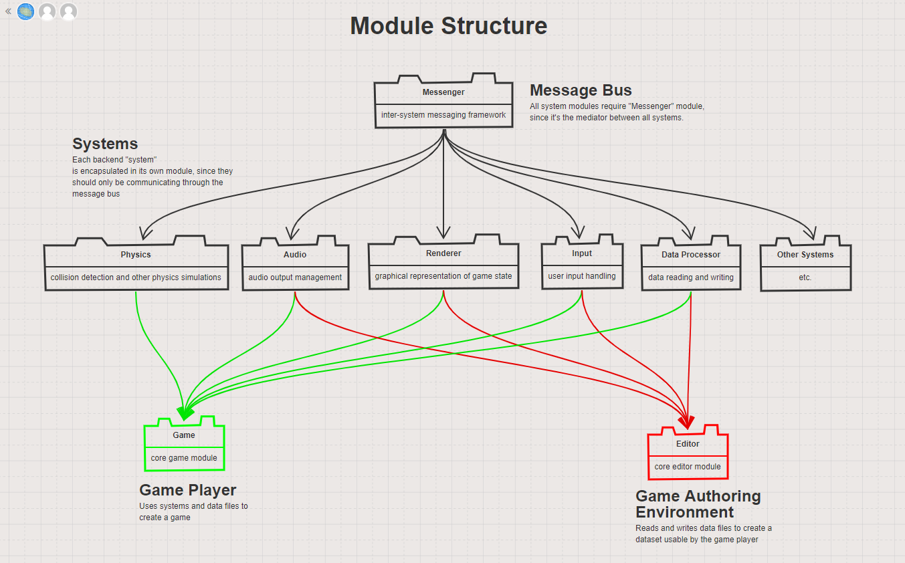
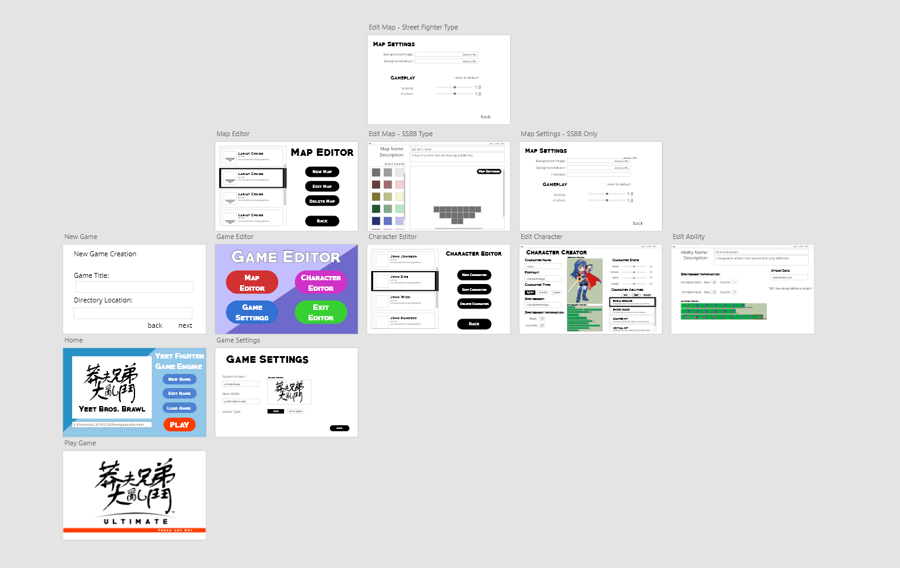

VOOGASalad Design
===

## Introduction
*This section describes the problem your team is trying to solve by writing this program, the primary design goals of the project (i.e., where is it most flexible), and the primary architecture of the design (i.e., what is closed and what is open). Describe your chosen game genre and what qualities make it unique that your design will need to support. Discuss the design at a high-level (i.e., without referencing specific classes, data structures, or code).*

We are creating this program to allow people with little to no programming background the ability to create a wide array of dynamic 2D fighting games. This includes the ability to control character creation, the ability to define combat physics, and the ability to design new stages to fight on.

The primary design goals for this project are to encapsulate project components as much as possible in order to allow great flexibility in creating new components and supporting new features, and to allow designers the ability to create any fighting game imaginable.

We chose the fighting game genre. In this genre, typically, two or more players who control their own characters will battle each other on a certain stage until a win condition has been met. There are several elements that make this game style unique. One of these is the “attack” mechanic of each character. Players will typically have heavily differentiated attack characteristics. Each character has its own hitbox, animation, and moveset, and each attach has its own animation, range, damage dealt, etc.

At a high level, our architecture will consist of a uniform module called the "message bus" that is passed between the different elements of our game that contains all of the inputs and outputs that get passed between the frontend and backend. Each of the game subsystems, such as the physics engine, audio system, etc., will be encapsulated in its own module as well. This will allow us to compartmentalize development, and test our program concurrently without the entire program already written. 

## Overview
*This section serves as a map of your design for other programmers to gain a general understanding of how and why the program was divided up, and how the individual parts work together to provide the desired functionality. Describe specific modules you intend to create, their purpose with regards to the program's functionality, and how they collaborate with each other, focusing specifically on each one's API. Include a picture of how the modules are related (these pictures can be hand drawn and scanned in, created with a standard drawing program, or screen shots from a UML design program). Discuss specific classes, methods, and data structures, but not individual lines of code.*

#### Module Structure: 
Our design will be composed of a multi-level module structure. At the lowest level, there will be a Messenger module, which provides the functionality for creating or supporting a MessageBus, which is the system through which all other systems will communicate with each other. Therefore, all game handling systems, such as Input Handling, Audio, Physics, etc., will all require this Messenger module.

These game handling systems will also be individual modules, since their functionality should be entirely encapsulated and should only interact with the other systems through the Messenger system.

Up on the highest level, the Game Player and the Game Editor will require the specific systems that they need in order to establish their functionality. For example, the Game Player requires the Render system, Audio system, Input system, Physics system.

There is one utility module, which is the Data module. Other modules will require this module to extract the information they need from XML files.



#### Class Structure:

* Module: Game Player
    * Exported (exposed):
        * ```public Class Player```
    * Not Exported (encapsulated):
        * ```public Class Screen```
* Module: Game Editor
    * Exported (exposed):
        * ```public Class Editor```
            * ``` public void createGame()``` creates folder for each user-made game containing XML files of character, map, gameplay configurations
            
    * Not Exported (encapsulated):
        * ```public class MapEditor```
        * ```public class CharacterEditor```
        * ```public class GameplayEditor```
        * ```public class MapEditor```
        * ```public class Tile```


* Module: Console
    * Exported (exposed):
        * ```public Class Console```
    * Not Exported (encapsulated):
        * 
* Module: Physics System
    * Exported (exposed):
        * ```public Class Interaction```
        * ```public Class InputHandler```
    * Not Exported (encapsulated):
        * ```public Class PhysicsObject```
        * ```public Class Shape```
* Module: Audio System
    * Exported (exposed):
        * ``` public class AudioSystem ```
    * Not Exported (encapsulated):
        * ``` public class AudioParser ```
* Module: Render System
    * Exported (exposed):
        * ``` public class Renderer```
            * ``` public Button makeStringButton(String text, Color buttonColor, Color textColor, Double x, Double y)```
            * ```public Button makeImageButton(Image image, Double x, Double y)```
            * ```public Text makeEmphasisText(String text, Integer fontsize, Color color, Double x, Double y)```
            * ```public Text makePlainText(String text, Integer fontsize, Color color, Double x, Double y)```
            * ```public ScrollPane makeGridScrollPane(List<ImageView> contentList)```
            * ```public ScrollPane makeListScrollPane(List<Data> dataList)```
            * ```public void drawStage(Group root, Level level)```
            * ```public TextField makeTextField(String text)```
            * ```public Slider makeSlider(Double field)```
            * ```public FileChooser makeFileChooser(String filetype)```
            * ```public DirectoryChooser makeDirectoryChooser()```
            * ```public SwitchButton makeSwitchButtons(List<String> options)```
            * ```public Carousel makeCarousel(List<String> options)```
            * ```java
              public SpriteAnimation makeSpriteAnimation(Sprite sprite,
              Double duration, Integer count, Integer columns, Double offsetX, 
              Double offsetY, Double width, Double height) 
              ```
            * ```public Sprite makeSprite(Image image, Double offsetX, Double offsetY)```
        * ``` public class SwitchButton```
        * ``` public class Carousel```
        * ``` private class SpriteAnimation```
        * ```private class Sprite```
    * Not Exported (encapsulated):
* Module: Input System
    * Exported
        * ``` public class InputSystem```
            * ```public inputCatcher() ```
            *
    * Not Exported
        * ``` public class Parser ```
            * ```public parseInput(KeyEvent e)```
            * ```private reflect(String s)```
        * ``` public class TimeHandler ```
            * ``` public comboWatcher(List<String>)```
            * ``` private timeBetweenCalc(Map<String, TimeStamp>)```
        * ``` public class DataReciever ```
            * ``` public recieveData(Event event) ```
            * ``` public dataTransfer(Map<String, String>)```
* Module: Scene System

    * Exported
        * ```public class SceneSystem```
    * Not Exported
        
* Module: Combat System
    * Exported
        * ```public class CombatSystem```
    * Not Exported
        * ```public class Player```
        * ```public class PlayerManager```
        
* Module: Data Processor
    * Exported
        * ```public class XMLSaveBuilder```
        * ```public class XMLParser```
* Module: Main
    * Exported (exposed):
        * ```public class Main```
            * ```public void start(Stage primaryStage)```

## User Interface

*This section describes how the user will interact with your program (keep it simple to start). Describe the overall appearance of program's user interface components and how users interact with these components (especially those specific to your program, i.e., means of input other than menus or toolbars). Include a wireframe of your GUI(s) as well as describing how a game is represented to the designer and what support is provided to make it easy to create a game. Finally, describe any erroneous situations that are reported to the user (i.e., bad input data, empty data, etc.).*

The user interface will consist of a main window where the game is displayed and the keyboard. Upon starting the program, the user will be taken to a start screen, where they can select the option to either create a new fighting game, edit an existing fighting game, or play a fighting game from a selection of defaults.

If edit/create a new game is selected, users will be taken to the Game Authoring Environment main screen, which will have three buttons that link to further pages: the map editor, the character editor, and the game settings editor. The user will be asked to save their progress and give their game a name when initializing a game or when exiting the editor.

When using the map editor, users can create a new map, edit a map, or delete a map. They can select the map they want in a window to the left.
If they are editing or creating a map, they will be taken to a new screen where they can use a block palette to drag and drop blocks into a grid.
There will also be map settings where the user can specify the background music, background image, and other settings.

When using the character editor, users will have the option to create a character, edit one, or delete one. They can select the desired character in a window to the left. If editing or creating a character, users will be directed to an assembly screen where they can specify the equipment, headgear, special attacks, etc.

If playing a game, users will be taken to a screen listing the different options for games to play. After selecting the game, users will then go to a character selection screen. After selecting the characters, users will then go to a map selection screen. After selecting the map, users will finally be able to begin playing the game.




## Design Details

*This section describes each module introduced in the Overview in detail (as well as any other sub-modules that may be needed but are not significant to include in a high-level description of the program). Describe how each module handles specific features given in the assignment specification, what resources it might use, how it collaborates with other modules, and how each could be extended to include additional requirements (from the assignment specification or discussed by your team). Look for opportunities to share APIs between your sub-teams (e.g., authoring and player front ends or authoring and engine back ends) that may themselves be separate modules (like Java and JavaFX are composed of several modules). Note, each sub-team should have its own API for others in the overall team or for new team members to write extensions. Finally, justify the decision to create each module with respect to the design's key goals, principles, and abstractions.*

Functionality:

Game player:
* Main menu
    * static background image
    * help text
    * play button
        * neutral
        * on-hover
        * selected
    * asdf
* fight
    * health bar
    * lives left
    * background
    * characters

Game Authoring Environment:
* Camera/View
     * fixed 
     * mobile (horizontal and/or vertical)

* create characters
    * Sprite
        * player controlled (PvP)
        * NPC (PvE)
    * set stats
    * define behaviors for objects using groovy
* create stages
    * Platform 
        * grounded or groundless
        * floating blocks
* HUD 
    
* Composition design pattern
    * user can package what they want in their game into some data object
    * easily interchange pieces
* Sandbox pattern? 

* Save/Load game
    * Save the current state of the game
    * Load a previously-defined game

Scene System:
* Turn on and off system based on what stage users are currently in:
    * When users first enter the main menu, systems related to the gameplay like InputHandler and Physics Engine should be shut down. 

Combat System:
* Backend class for all combat-related data 
* Data to keep track of:
    * Each player's health
    * Each player's power level
    * Each player's character info:
        * Different characters have different characteristics
        * Enable outside system to pass in values to initialize each player's info field(health, attack damage etc.)
    * Each player's status:
        * In air or on the ground
        * Moving or static
        * In attack animation or not(to implement combo, we possibly need to track the time after a player attacked and what type of attack)
        * whether the player is being attacked
        * need to know which other player this player is hitting 
    * Whether win condition is met:
* A helper class to track the interaction between each players
* Send message when player's info displayed on the HUD is changed:
    * Example 1: if one character successfully hits another character, the combat system will send a message via message bus to tell systems that are responsible for HUD to update the health bar for the attacked character
* Make sure player-triggered action is valid:
    * Examples: if the character is already in air and players press jump again, combat system should send back a message indicating that the jump command will do nothing. 

Main (Game Loop):
* Speed
    * 60 Frames Per Second
    * Interpolation implemented to maintain smoothness
    * Fixed Time Step
* GameLoop()
    * Multi-threaded
    * One thread per loop. Running a second view of the game opens a new Thread
* Update()
    * Calls the physics engine to update game. 
* Render(double Interpolation)
    * Renders the game. Takes into account the interpolation, to keep animations up with speed

Physics:
* RigidBody (Abstract)
    * RigidObject
        * GameElement is composed of this
        * Move according to key input, collisions, and gravity
    * RigidGround
        * Structure is composed of this
        * Never move
        * RigidObjects are stopped by this according to type
        * 2 Basic Types:
            * One that is impenetrable from all directions
            * One that a RigidBody can jump into from underneath and land on top
* Gravity
    * Speed of gravity depends on weight
    * Direction of gravity depends on game authoring settings
* Collision Detection
    * Will check each element each frame (this will be O(n^2), but is easiest)
    * Sectors
* Net force calculator
    * Takes in all the forces acting on a physics object, calculates its net force

* Acceleration calculator
    * Takes in the net force acting on an object and generates acceleration vectors
Input System
* Catching Key Inputs
    * Key inputs are listened for as long as the game is in combat form
    * The input system recieves a mapping from the data processor that maps key inputs to whatever the user
      decided it to be. 

* Parsing Key Inputs
    * A key input is immediately sent to the Parser class if it is valid once it is input. The parser turns the 
      input into a common form that the user defined. For example, if the user wanted the "A" key to represent a 
      Strong attack, then the Parser will turn KeyEvent.A into "StrongAttack". 

* Catching combos
    * Each input is given a timestamp. There will be a set time interval that is decided by the user in which
      a combo will register. For example, if the player inputs A, B, C, all within a certain time interval of 
      each other, then the combo ABC will set off. 
    * A helper class will be evaluating constantly the validity of inputs by the user and whether they are eligible to 
      be a combo 

* Handling charged attacks
    * Handling charged attacks will be the same as if the user is clicking the Directional move button. Essentially,
      if a key is pressed for more than a certain amount of time, such as 0.05s, then the program thinks the button
      is being continuously pressed. Some buttons though, such as the attack ones, will not do anything if they are
      continuously pressed unless they are attacks that can be charged (smash attacks).
      
## Example Games

*Describe three example games from your genre in detail that differ significantly. Clearly identify how the functional differences in these games is supported by your design and enabled by your authoring environment. Use these examples to help make concrete the abstractions in your design.*

#### Super Smash Bros. Brawl:
This game is heavily reliant on the physics engine for combat. Rather than using HP, this game uses a damage percentage, where the higher the percentage, the farther the character is knocked back when hit. The character "dies" when they are unable to recover from a hit and get forced off the edge of the screen. Characters are able to move very fluidly by running, jumping, gliding (by changing their trajectory midair), and, for some characters, flying to a limited extent (by having the ability to jump many times). The stage for the game is composed of platforms and, oftentimes, walls or other features that may help or hinder the characters. The cast of characters is incredibly diverse, each having his/her own size, weight, and hitbox, all of which influence the physics of how each character moves and the amount of knockback each experiences. Each character also has a variety of diverse special melee and ranged moves, and are able to shield, roll, sidestep, and grab other characters. Each character possesses a unique "Final Smash" ability that is enabled upon scoring the last hit on a "Smash Ball", which is a floating orb that appears at a pseudo-regular interval during the fight. However, a character with the "Final Smash" ability can lose the opportunity to use it if they are sufficiently damaged by another player. 

#### Street Fighter:
This game is relatively simple in terms of mechanics. Players use a variety of attacks to either reduce the HP of their opponent to 0 or to deal more damage to their opponent than they receive during the time limit. In this game, players cannot leave the screen and will always face each other. Players access their character's special moves by inputting certain combinations of buttons. For example, for the character Ryu, if the player inputs the correct sequence, he will shoot out a "Hadoken" projectile that deals a certain amount of damage to the opponent upon contact. Players can also execute combo attacks: follow-up attacks to a hit where the player must input the right buttons to continue hitting their opponent.


#### Mortal Kombat:
While Mortal Kombat plays much more like Street Fighter than Smash Bros, there are some key aspects that make Mortal Kombat unique, or at least different from many other fighting games. In Mortal Kombat, the user is given significantly more options for moves: each move has its own combination. The moves play out in longer animations (almost like cutscenes) and deal a variety of effects to the opponent. This style of combat is significantly different from Street Fighter, which has shorter combination moves and requires constant input from both fighters.

## Design Considerations

*This section describes any issues which need to be addressed or resolved before attempting to devise a complete design solution. Include any design decisions that each sub-team discussed at length (include pros and cons from all sides of the discussion) as well as any ambiguities, assumptions, or dependencies regarding the program that impact the overall design.*

The largest issue we discussed was how to organize the many moving parts of the game. We considered a number of frameworks and hierarchies. The first proposal we considered was to split everything into front end and back end, similar to what many of us did for Slogo. However, this will be ineffective as time goes on because there will soon be too many cross dependencies between different aspects of the project. Instead, we opted for a module system, as described earlier in the plan. The disadvantage here is that code is generally more dispersed within the overall project, but we believed that the advantages of the structure, which are the limited redundancies of code and the easy division of labor, outweigh this disadvantage. We will still have to be dedicated and organized, so modules and APIs are written in the right order, and the dependencies are limited.


Some issues that need to be addressed include what information we plan on sending to and receiving from the message bus and how to format the data files we will use. We ended up deciding on the XML format for storing/parsing data. While other frameworks such as JSON might be easier to use, we all have experience using XML in the Cell Society project.


